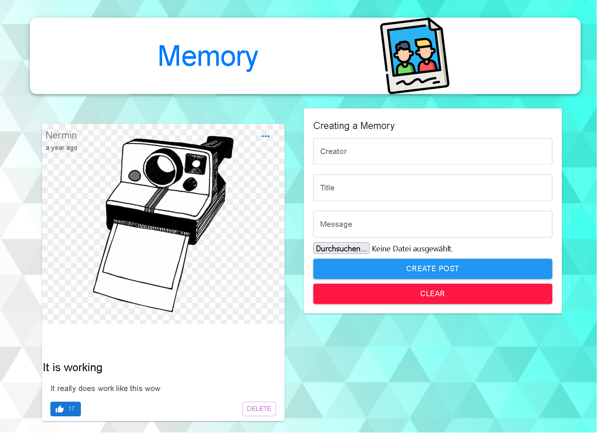

# MERN stack CRUD Application

## Introduction

This is a CRUD application that was built with the MERN stack which is a clone of the Instagram starting page.

Technologies I used for this project are:
- React.js
- TypeScript
- Express.js
- Node.js
- MongoDB
- TailwindCSS / MaterialUI

## Setup

- Connect to a MongoDB database
- Run `npm i && npm start` for both the client and server side to start the app

